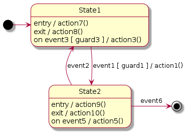

# StateMachine

This [repository](https://github.com/Lecrapouille/StateMachine) offers a Python 3 tool for:
- Translating [PlantUML statecharts](https://plantuml.com/fr/state-diagram) file into C++ code of state machine.
- The generated code is a compromise between simplicity to read, no virtual methods, memory foot print.
- It's also generates some C++ unit tests to check your state machine.
- Do some basic verification if your state machine is well form.


*Example of statechart the tool can parse.*

## Limitation: what the tools does not offer

- Parsing Hierarchic State Machine (HSM). It only parses simple Finite State Machine (FSM). I'm thinking to redo the
  project using a flex/bison-like parser. 
- Does not parse fork, concurrent states, composite states, pseudo states, history.
- Does not manage multi edges (several transitions from the same origin and destination state). As consequence, you
  cannot add several `on event` in the same state.
- In gestation: add parameters to events. In this [project](https://www.itemis.com/en/yakindu/state-machine/documentation/user-guide/overview_what_are_state_machines) they used it, I tried it but this way may reach some segfaults. So for the moment
  I have not yet good solutions.
- Does not offer formal proof to check if your output transitions from a state are mutual exclusive or if
  some branches are not reachable. This is too complex: we need to parse and understand C++ code. For example, in
  this [diagram](doc/RichMan.png) if initial quarters value start with negative value, you will be stucked in the
  state `CountQuarter`. In the same idea: events on output tansitions shall be mutually exclusive but the tool cannot
  parse C++ logic.
- Does not give 100% of compilable C++ code source. It depends on the code of your gards and actions. It should be
  simple valid C++ code. The main code of the generated state machine is functional you do not have to modify it but
  you may have to clean a little the code for your gards, actions, add member variables to complete the compilation.

## Prerequisite

- Python3.
- networkx https://networkx.org/ the tool read PlantUML file and create a DiGraph (shall be a MultiDiGraph) as intermediate
  structure before generating the C++ code.

```
python3 -m pip install networkx
```

## Command line

```
./parser.py <plantuml statechart file> <cpp|hpp> [name]
```

Where:
- `plantuml statechart file` is the path of the [PlantUML statecharts](https://plantuml.com/fr/state-diagram) file as input.
   This repo contains [examples](examples/input).
- `cpp|hpp` is either `"cpp"` to force create a C++ source file or `"hpp"` to force create a C++ header file.
- `name` is optional and allow to give prefix to the C++ class name and file.

Example:
```
./parser.py foo.plantuml cpp controller
```

Will create a `FooController.cpp` file with a class name `FooController`.

## PlantUML statecharts syntax

PlantUML statecharts syntax:
- `FromState --> ToState : event [ guard ] / action`
- `FromState -> ToState : event [ guard ] / action`
- `ToState <-- FromState : event [ guard ] / action`
- `ToState <- FromState : event [ guard ] / action`
- Note: `[ guard ]` and `/ action` are optional.
- `State : entry / action`
- `State : exit / action`
- `State : on event [ guard ] / action` Where `[ guard ]` is optional.
- The statechart shall have one `[*]` as source.
- Optional `[*]` as sink.
- `'` for single-line comment.

Note: Keywords `' / [ ]` shall be sperated by at least one space (left and right side) else the parse does not split tokens
correctly.

Note: I added some sugar syntax:
- `State : entering / action` alias for `State : entry / action`.
- `State : leaving / action` alias for `State : exit / action`.
- `State : comment / description` to add a C++ comment for the state in the generated code.
- `\n--\naction` alias for `/ action` to follow Structured Analysis for Real Time syntax (but also to force carriage return on
  PlantUML diagrams).

I added some syntax to help generate extra C++ code. They start with the `'` keyword which is a PlantUML single line comment
so they will not produce syntax error when PlantUML is parsing the file but, on our side, we exploit them.
- `'header` for adding code in the header of the file, before the class of the state machine. You can include other C++ files, create or define functions.
- `'footer` for adding code in the footer of the file, after the class of the state machine.
- `'init` is C++ code called by the constructor or bu the `reset()` function.
- `'code` to allow you to add member variables or member functions.

## Rule of execution


- State1 is entering: `action7` is called.
- `event3` may be triggered and if the `guard3` returns `true` then the `action3` is called.
- If `event1` is triggered and if the `guard1` returns `true` then the State1 exit `action8` is called; then the transition `action1` is called.
- State2 is entering: `action9` is called.
- `event5` may be triggered then the `action5` is called.
- If `event2` is triggered then the State2 exit `action10` is called. Else if `event6` is triggered then the State2 exit `action10` is called.

## Things that I did not understand about state machines before this project

At the beginning, I did not understand differences between the State/Transition diagram (STD) from the Structured Analysis for Real Time methodology with the UML statechart. In STD actions are made by transitions, while in UML all cases were possible.

What I understood after: in 1956 there were to kind of state machines: Moore in where actions where called from states and Mealy in where actions where called from transitions. They describe exactly the same system and you can translate a Moore machine into a Mealy machine and vice versa, without losing any expressiveness [cite](https://www.itemis.com/en/yakindu/state-machine/documentation/user-guide/overview_what_are_state_machines). In 1984, Harel mixed the two syntax plus added some features (composite ...) and named it statecharts. Finally UML integrated statecharts. In this [document](https://cs.emis.de/LNI/Proceedings/Proceedings07/TowardEfficCode_3.pdf) they simplify
the statechart graph to get a Mealy graph before generating the code. In the case of our translator, we keep both cases because we want to generate simple code that people can easily read and understand.

## References

- https://www.itemis.com/en/yakindu/state-machine/documentation/user-guide/overview_what_are_state_machines
- https://www.codeproject.com/Articles/1087619/State-Machine-Design-in-Cplusplus-2
- https://cs.emis.de/LNI/Proceedings/Proceedings07/TowardEfficCode_3.pdf
- https://www.espacetechnologue.com/wp-content/uploads/2017/03/2_DeveloppementApp_STRv11.pdf
