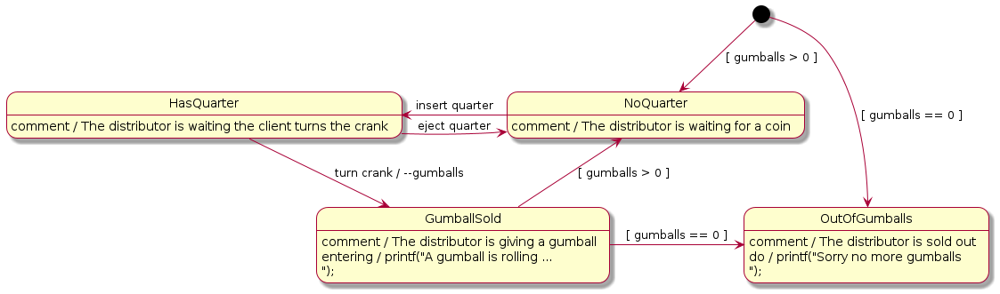

# PlantUML Statecharts (State Machine) Translator

A Python 3 tool that parses
[PlantUML statecharts](https://plantuml.com/fr/state-diagram) and
generates C++ code with companion unit tests.

This [repository](https://github.com/Lecrapouille/Statecharts) ships:

- A single-file [C++11 state-machine base](include/StateMachine.hpp)
  that you can drop into your own project.
- A Python 3 script
  [`translator/statecharts.py`](translator/statecharts.py) that turns
  PlantUML statecharts into a C++11 child class of the base header.
- Several [example PlantUML files](examples/) plus a Makefile that
  renders their PNG diagrams and compiles the generated code.

[](examples/Gumball.plantuml)

> **Looking for a modern C++20 backend?** A sister project,
> [`UML-Statechart-Framework-for-Java`](https://github.com/lecrapouille/UML-Statechart-Framework-for-Java),
> integrates this translator with a modern C++20 statechart library
> (no `StateMachine.hpp`, no GoogleMock dependency). The Python
> grammar and pipeline are the same; only the emitted C++ differs.

## Quick start

```sh
# Install Python dependencies.
pip install lark networkx

# Translate a PlantUML file to C++ code + tests.
./translator/statecharts.py examples/Gumball.plantuml cpp

# Or render diagrams and compile every example.
cd examples && make -j8
```

The script signature is:

```sh
./translator/statecharts.py <file.plantuml> <cpp|hpp> [postfix]
```

`postfix` is appended to the generated C++ class name and file name.

## Features

- Generate a compromise between simplicity (no virtual methods, low
  memory footprint) and self-contained code (no external library, no
  [boost::sml](https://github.com/boost-ext/sml)).
- Basic verifications on the parsed FSM (well-formedness checks).
- Generates [GoogleTest](https://github.com/google/googletest) C++
  unit tests next to the FSM class.
- Separates the generic FSM logic (the base header) from the
  user-facing state-machine class (the child generated from the
  PlantUML file).

## Documentation

| Document | Description |
| --- | --- |
| [doc/details/syntax.md](doc/details/syntax.md) | PlantUML statecharts syntax accepted by the translator and the `'[brief]/[header]/[code]/...` injection directives. |
| [doc/details/concepts.md](doc/details/concepts.md) | Notes on Moore vs. Mealy machines, action vs. activity, and the rules of execution applied by the translator. |
| [doc/details/limitations.md](doc/details/limitations.md) | What the tool cannot do today (HSM, fork/join, history, multi-edges, formal verification, ...). |
| [doc/details/design.md](doc/details/design.md) | Internal pipeline (Lark → Networkx → C++) and the legacy `StateMachine.hpp` backend's design decisions. |
| [doc/details/references.md](doc/details/references.md) | Bibliography. |

## License

Released under the GNU General Public License v3 (or later); see file
headers for the exact terms.
