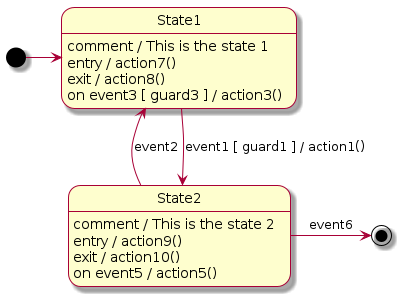

# PlantUML Statecharts (State Machine) Translator

A Python3 tool parsing [PlantUML statecharts](https://plantuml.com/fr/state-diagram)
scripts and generating C++11 code with its unit tests.

This [repository](https://github.com/Lecrapouille/Statecharts) contains:
- A single C++11 header file containing the base code for defining a state
  machine. You can use it to define manually your own state machines. The code
  is [here](include/StateMachine.hpp).
- A Python3 script reading [PlantUML
  statecharts](https://plantuml.com/fr/state-diagram) and generating Statecharts
  (aka finite state machines or FSM) in C++11 code as a child class of the base
  state machine defined in the header file. The code is
  [here](translator/statecharts.py).
- Several [examples](examples) of PlantUML statecharts are given.

The Python script offers you:
- To generate code in a compromise between simplicity to read, no virtual
  methods, memory footprint, and no usage of external lib (such
  [boost](https://github.com/boost-ext/sml) lib).
- To do some basic verification to check if your state machine is well
  formed.
- To generate C++ unit tests (using [Google
  tests](https://github.com/google/googletest)) to verify if your state machine
  is functional.
- The goal of this tool is to separate things: one part is to manage the logic of
  how a state machine shall work (the base class), and the second part is to write
  code in a descriptive way (the child class).

Here is an example of PlantUML code source, generating this kind of diagram,
this tool is able to parse (Click on the figure to see the PlantUML code source):

[](examples/Gumball.plantuml)

This repository also contains several more evolved
[examples](examples/README.md) of statecharts the tool can parse. For people not
sure how state machines work, there are several links explaining them given
in the last section of this document.

## Limitation: what the tools cannot offer to you

- Generate only C++ code. You can help contributing to generate other languages.
- Parsing Hierarchic State Machine (HSM). Currently, the tool only parses simple
  Finite State Machine (FSM). I'm thinking about how to upgrade this tool.
- For FSM, the tool does not parse fork, concurrent states, composite states,
  pseudo-states, history.
- For FSM, the `do / activity` and `after(X ms)` are not yet managed.
- Does not manage multi-edges (several transitions from the same origin and
  destination state). As consequence, you cannot add several `on event` in the
  same state.
- I am not a UML expert, so probably this tool does not follow strictly UML
  standards. This tool has not yet been used in real production code.
- Does not offer formal proof to check if your output transitions from a state
  are mutually exclusive or if some branches are not reachable. This is currently
  too complex for me to develop (any help is welcome): we need to parse and
  understand C++ code. For example, in the previous [diagram](doc/RichMan.png),
  if the initial count of quarters starts with a negative value, you will be stuck in
  the state `CountQuarter`. In the same idea: events on output transitions shall
  be mutually exclusive but the tool cannot parse C++ logic. And finally for
  unit tests, to help generate good values
- Does not give 100% of compilable C++ code source. It depends on the code of
  your guards and actions. It should be simple valid C++ code. The main code of
  the generated state machine is functional you do not have to modify it but you
  may have to clean a little the code for your guards, actions, add member
  variables to complete the compilation.

## Prerequisite

- Python3 and the following packages:
  - [Lark](https://github.com/lark-parser/lark) a parsing toolkit for Python. It
    is used for reading PlantUML files.
  - [Networkx](https://networkx.org/) before the PlantUML is translated into C++
    file, a directed graph structure is created as an intermediate structure before
    generating the C++ code (shall be ideally a MultiDiGraph).
- [PlantUML](https://plantuml.com) called by the Makefile to generate PNG pictures
  of examples but it is not used by our Python3 script.

```
python3 -m pip install networkx lark
```

## Command line

```
./statecharts.py <plantuml statechart file> <langage> [name]
```

Where:
- `plantuml statechart file` is the path of the [PlantUML
   statecharts](https://plantuml.com/fr/state-diagram) file as input.  This repo
   contains [examples](examples/input).
- `langage` is either `"cpp"` to force create a C++ source file or `"hpp"` to
  force create a C++ header file.
- `name` is optional and allows giving prefix to the C++ class name and file.

Example:
```
./statecharts.py foo.plantuml cpp controller
```

Will create a `FooController.cpp` file with a class name `FooController`.

## Compile Examples

```
cd examples
make -j8
```

Examples are compiled into the `build` folder as well as their PNG file.
You can run binaries. For example:
```
./build/Gumball
```

## PlantUML Statecharts syntax

This tool does not pretend to parse the whole PlantUML syntax or implement the
whols UML statecharts standard. Here is the basic PlantUML statecharts syntax it
can understand:
- `FromState --> ToState : event [ guard ] / action`
- `FromState -> ToState : event [ guard ] / action`
- `ToState <-- FromState : event [ guard ] / action`
- `ToState <- FromState : event [ guard ] / action`
- `State : entry / action`
- `State : exit / action`
- `State : on event [ guard ] / action` Where `[ guard ]` is optional.
- `'` for single-line comment.
- The statecharts shall have one `[*]` as a source.
- Optionally `[*]` as a sink.

- Note: `[ guard ]` and `/ action` are optional. You can add C++ code (the less
  the better, you can complete with `'[code]` as depicted in this section). The
  tool shall manage spaces between tokens `-->`, `:`, `[]`, and `/`. The `event`
  is optional it can be spaced but shall refer to a valid C++ syntax of a
  function (so do not add logic operations).

Note: I added some sugar syntax:
- `State : entering / action` alias for `State : entry / action`.
- `State : leaving / action` alias for `State : exit / action`.
- `State : comment / description` to add a C++ comment for the state in the
  generated code.
- `\n--\n action` alias for `/ action` to follow State-Transition Diagrams used
  in [Structured Analysis for Real
  Time](https://academicjournals.org/journal/JETR/article-full-text-pdf/07144DC1419)
  (but also to force carriage return on PlantUML diagrams).

I added some syntax to help generate extra C++ code. They start with the `'`
keyword which is a PlantUML single-line comment so they will not produce syntax
error when PlantUML is parsing the file but, on our side, we exploit them.
- `'[brief]` for adding a comment for the generated state machine class.
- `'[header]` for adding code in the header of the file, before the class of the
  state machine. You can include other C++ files, and create or define functions.
- `'[footer]` for adding code in the footer of the file, after the class of the
  state machine.
- `'[param]` are arguments to pass to the state machine C++ constructor. Commas
  are added. One argument by line.
- `'[cons]` to allow init the argument before the code of the constructor.
  One argument by line.
- `'[init]` is C++ code called by the constructor or bu the `reset()` function.
- `'[code]` to allow you to add member variables or member functions.
- `'[test]` to allow you to add C++ code for unit tests.

## Things that I did not understand about state machines before this project

In the beginning, I did not understand the differences between the State/Transition
diagram (STD) from the Structured Analysis for Real-Time methodology with the
UML statechart. In STD actions are made by transitions, while in UML actions are
made by transitions or by states. I was confused.

What I understood after: in 1956 there were two kinds of state machines: Moore in
where actions were called from states and Mealy where actions were called
from transitions. They describe exactly the same system and you can translate a
Moore machine into a Mealy machine and vice versa, without losing any
expressiveness
[cite](https://www.itemis.com/en/yakindu/state-machine/documentation/user-guide/overview_what_are_state_machines). In
1984, Harel mixed the two syntaxes plus added some features (composite ...) and
named it statecharts. Finally UML integrated statecharts in their standard.

Some tools like the one explained in this
[document](https://cs.emis.de/LNI/Proceedings/Proceedings07/TowardEfficCode_3.pdf)
simplify the statecharts graph to get a Mealy graph before generating the
code. In the case of our translator, to keep the code simple to read, the state
machine is not simplified and actions are made by states and by transitions.

Another point of confusion hat is the difference between action and activity.
The action is instantaneous: it does not consume time (contrary to the
activity). The activity can be seen as a thread that is preempted by any
external events the state reacts to. The thread is halted when the activity is
done or when the system switches state. Therefore, an activity shall not be
seen by a periodic external `update` event since its code does not necessarily be
repeated.

My last point of confusion concerned the order of execution of actions in
transitions and in states. I explain it in the next section.

## Rule of execution in Statecharts

Let's suppose the C++ code of the following state machine has been generated with
the C++ name class `Simple`.



- The system `Simple` is entering to `State1` (made active): the `action7` is
  called (private method of the class `Simple` or any local function).
- The external `event3` (public method of the class `Simple` or any local
  function) may occur and when this will happen, and if and only if the `guard3`
  returns `true` (boolean expression of a function returning a boolean), then the
  `action3` is called (method of the class `Simple` or any local function).
- If `event1` is triggered and if the `guard1` returns `true` then the system is
  leaving the `State1` and the exit `action8` is called followed by the
  transition `action1`.
- The system is entering `State2` (made active): the `action9` is called.
- `event5` may be triggered and once happening the `action5` is called.
- If `event2` is triggered then the `State2` exit `action10` is called. Else if
  `event6` is triggered then the `State2` exit `action10` is called.
- Note: when `event3` or `event5` are triggered, the entry and exit actions of
  the corresponding state is not called.
- An activity is started after the entry action and halted before the exit
  action.

If an output transition has no explicit event and no guard is given (or if the guard
is returning true) and the activity has finished then the transition is
immediately made in an atomic way. In our example, if `event1`, `event2`, and
`guard1` were not present this would create an infinite loop.

Events shall be mutually exclusive since we are dealing in discrete time events,
several events can occur during the delta time but since in this API you have to
call the event and the state machine reacts immediately, the order is defined by
the caller.

## Details Design

The translation pipeline of the Python script is the following:
- The [Lark](https://github.com/lark-parser/lark) parser loads the
  [grammar](tool/statechart.ebnf) file for parsing the PlantUML statechart
  file. Note: this grammar does not come from an official source (PlantUML does
  not offer their grammar. I manages a subset of their syntax).
- The [PlantUML statecharts](https://plantuml.com/fr/state-diagram) file is then
  parsed by Lark and an Abstract Syntax Tree (AST) is generated.
- This AST is then visited and a digraph [Networkx](https://networkx.org/)
  structure is created (nodes are states and arcs are transitions). Events and
  actions are stored to them.
- This graph is visited to make some verification (if the state machine is well
  formed ...), then to generate the C++ code source. Unit tests are generating
  from graph cycles or paths from source to sinks (what inputs make me reach the
  desired state) ...

How is the generated code? The state machine, like any graph structure (nodes
are states and edges are transitions) can be depicted by a matrix.

For example concerning the motor controller:


can be depicted in the following table (guards and actions are not
shown). In practice the table is usually sparse:

|                 | Set Speed  | Halt      | --        |
|-----------------|------------|-----------|-----------|
| IDLE            | STARTING   |           |           |
| STOPPING        |            |           | IDLE      |
| STARTING        | SPINNING   | STOPPING  |           |
| SPINNING        | SPINNING   | STOPPING  |           |

- The first column holds source states (origin).
- The first row holds events.
- For each event (therefore for each column) each matrix cell holds the
  destination state. The third column has no event, and the consequence is that
  the state is immediately transited.

Our implementation is the following:
- A private fixed-size array holds states and their entry/exit actions (pointers
  to private methods).
- Events are public methods. In each of them a static lookup table (a `std::map`
  for the sparse side) maps transitions (source states to destination states)
  shall be defined. This table also holds pointers to private methods for the
  guards and for actions. This table is used by a general private method doing
  all statecharts logic to follow the UML norm.
- The norm says that events shall be mutually exclusive (since we are dealing with
  discrete time events, several events can occur during the delta time). But
  since the API of C++ state machine only offers public methods to trigger the
  event, the exclusion shall be made uphill (by the caller function).
- The code is based on this
  [project](https://www.codeproject.com/Articles/1087619/State-Machine-Design-in-Cplusplus-2)
  but with several differences described:
  - The code uses the curiously recurring template pattern to use the child
    state machine class and use external enums for defining states (internal
    enums were not possible).
  - Actions and guards are placed on transitions.
  - Transition are parameters to the main function doing the logic of the state
    machine (transitions, calling guards, and actions).
  - I also merge internal and external transitions into a single function. I also
    use an internal queue.

## References

- [Yakindu statecharts](https://www.itemis.com/en/yakindu/state-machine/documentation/user-guide/overview_what_are_state_machines)
  YAKINDU Statechart Tools is a tool for specializing and developing state machines.
- [Developing Reactive Systems Using Statecharts](http://msdl.cs.mcgill.ca/people/hv/teaching/MoSIS/lectures/StatechartsModellingAndSimulation.pdf)
  a well-made English course to statecharts.
- [Modeliser les vues dynamiques d'un systeme](http://niedercorn.free.fr/iris/iris1/uml/uml09.pdf)
  an introduction to UML statecharts in French.
- [ML/SysML Diagramme d'etat Programmation Arduino](https://eduscol.education.fr/sti/ressources_pedagogiques/umlsysml-diagramme-detat-et-programmation-arduino#fichiers-liens)
  a French course to statecharts with open source code source. The API is simple
  to read but is the only one I saw offering HSM, activities, and history, ...
- [State Machine Design in C++](https://www.codeproject.com/Articles/1087619/State-Machine-Design-in-Cplusplus-2)
  The C++ code of our state machine is inspired by this project.
- [Towards Efficient Code Synthesis from Statecharts](https://cs.emis.de/LNI/Proceedings/Proceedings07/TowardEfficCode_3.pdf)
  Research paper on how to generate state machine.
- [Real-Time Structured methods: Systems Analysis](https://www.amazon.com/Real-Time-Structured-Methods-Analysis-Engineering/dp/0471934151)
  by Keith Edwards, Edition Wiley 1993.SART can be seen as the ancestor of UML
  in which mainly three diagrams are used: -- diagrams describing how data
  (information) are transformed (discrete and continuous) -- diagrams describing
  how data flow is controlled: processes from the first diagram are enabled,
  disabled or triggered, -- and finally diagrams describing behavior over time:
  they are mainly depicted by a state transition diagram (therefore a state
  machine) describing how the control flow (second diagram) controls the data
  flow (first diagram).
- [Sructured Analysis for Real Time](https://www.espacetechnologue.com/wp-content/uploads/2017/03/2_DeveloppementApp_STRv11.pdf)
- [UML Behavioral Diagrams: State Transition Diagram](https://youtu.be/OsmWASXE2IM) and
  [State Transition Diagram](https://youtu.be/PF9QcYWIsVE) YouTube videos made by the
  Georgia Tech Software Development Process.

