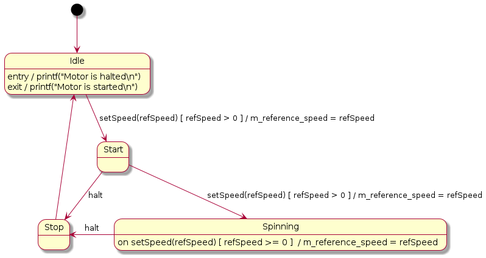

# PlantUML Statecharts (State Machine) Translator

This [repository](https://github.com/Lecrapouille/StateMachine) offers a Python
v3 script for generating finite state machines (FSM) in C++11 from [PlantUML
statecharts](https://plantuml.com/fr/state-diagram):
- The generated code is a compromise between simplicity to read, no virtual
  methods, memory foot print.
- The tool does some basic verification to check if your state machine is well
  formed.
- The tool also generates C++ unit tests (in [Google
  tests](https://github.com/google/googletest)) to verify if your state machine
  is functional.
- The goal of this tool is to separated things: one part manages the logic of
  how a state machine shall work, the second part is to write code in a
  descriptive way.

Here an example of state machine with all the syntax the tool is able to parse:


This repository also contains several more evolved
[examples](examples/README.md) of statecharts the tool can parse. For people not
sure on how state machines work, there are several links on courses in the last
section of this document.

## Limitation: what the tools cannot offer to you

- Parsing Hierarchic State Machine (HSM). Currently, the tool only parses simple
  Finite State Machine (FSM). I'm thinking on how to upgrade this tool.
- For FSM, the tool does not parse fork, concurrent states, composite states,
  pseudo states, history.
- For FSM, the `do / activity` and `after(X ms)` are not yet managed.
- Does not manage multi edges (several transitions from the same origin and
  destination state). As consequence, you cannot add several `on event` in the
  same state.
- I am not an UML expert, so probably this tool does not follow strictly UML
  standard. This tool has never been used in production code.
- Does not offer formal proof to check if your output transitions from a state
  are mutual exclusive or if some branches are not reachable. This is current
  too complex for me to develop it (any help are welcome): we need to parse and
  understand C++ code. For example, in the previous [diagram](doc/RichMan.png),
  if initial quarters value start with negative value, you will be stucked in
  the state `CountQuarter`. In the same idea: events on output transitions shall
  be mutually exclusive but the tool cannot parse C++ logic. And finally for
  unit test, to help generating good values
- Does not give 100% of compilable C++ code source. It depends on the code of
  your guards and actions. It should be simple valid C++ code. The main code of
  the generated state machine is functional you do not have to modify it but you
  may have to clean a little the code for your gards, actions, add member
  variables to complete the compilation.
- In gestation: add optional data to events. In this
  [project](https://www.codeproject.com/Articles/1087619/State-Machine-Design-in-Cplusplus-2)
  they used them, I tried it but this way may reach some segfaults. So for the
  moment I have not yet good solutions.

## Prerequisite

- Python3.
- [Lark](https://github.com/lark-parser/lark) a parsing toolkit for Python. It
  is used for reading PlantUML file.
- [Networkx](https://networkx.org/) before the PlantUML is translated into C++
  file, a directed graph structure is created as intermediate structure before
  generating the C++ code (shall be ideally a MultiDiGraph).
- [PlantUML](https://plantuml.com) to generate pictures of examples (Makefile)
  and it is not used by our tool.

```
python3 -m pip install networkx lark
```

## Command line

```
./parser.py <plantuml statechart file> <cpp|hpp> [name]
```

Where:
- `plantuml statechart file` is the path of the [PlantUML
   statecharts](https://plantuml.com/fr/state-diagram) file as input.  This repo
   contains [examples](examples/input).
- `cpp|hpp` is either `"cpp"` to force create a C++ source file or `"hpp"` to
  force create a C++ header file.
- `name` is optional and allow to give prefix to the C++ class name and file.

Example:
```
./parser.py foo.plantuml cpp controller
```

Will create a `FooController.cpp` file with a class name `FooController`.

## Compile Examples

```
cd examples
make -j8
```

Examples are compiled into the `build` folder. You can run binaries. For example:
```
./build/Gumball
```

## PlantUML Statecharts syntax

This tool does not pretend to understand all PlantUML syntax or UML statecharts.
Here is the basic PlantUML statecharts syntax it can understand:
- `FromState --> ToState : event [ guard ] / action`
- `FromState -> ToState : event [ guard ] / action`
- `ToState <-- FromState : event [ guard ] / action`
- `ToState <- FromState : event [ guard ] / action`
- `State : entry / action`
- `State : exit / action`
- `State : on event [ guard ] / action` Where `[ guard ]` is optional.
- `'` for single-line comment.
- The statecharts shall have one `[*]` as source.
- Optionally `[*]` as sink.

- Note: `[ guard ]` and `/ action` are optional. You can add C++ code (the less
  the better, you can complete with `'[code]` as depicted in this section). The
  tool shall manage spaces between tokens `-->`, `:`, `[]` and `/`. The `event`
  is optional it can be spaced but shall refer to a valid C++ syntax of a
  function (so do not add logic operations).

Note: I added some sugar syntax:
- `State : entering / action` alias for `State : entry / action`.
- `State : leaving / action` alias for `State : exit / action`.
- `State : comment / description` to add a C++ comment for the state in the
  generated code.
- `\n--\n action` alias for `/ action` to follow State-Transition diagrams used
  in [Structured Analysis for Real
  Time](https://academicjournals.org/journal/JETR/article-full-text-pdf/07144DC1419)
  (but also to force carriage return on PlantUML diagrams).

I added some syntax to help generate extra C++ code. They start with the `'`
keyword which is a PlantUML single line comment so they will not produce syntax
error when PlantUML is parsing the file but, on our side, we exploit them.
- `'[header]` for adding code in the header of the file, before the class of the
  state machine. You can include other C++ files, create or define functions.
- `'[footer]` for adding code in the footer of the file, after the class of the
  state machine.
- `'[param]` are arguments to pass to the state machine C++ constructor. Commas
  are added. One argument by line.
- `'[init]` is C++ code called by the constructor or bu the `reset()` function.
- `'[code]` to allow you to add member variables or member functions.

## Things that I did not understand about state machines before this project

At the beginning, I did not understand differences between the State/Transition
diagram (STD) from the Structured Analysis for Real Time methodology with the
UML statechart. In STD actions are made by transitions, while in UML actions are
made by transitions or by states. I was confused.

What I understood after: in 1956 there were to kind of state machines: Moore in
where actions where called from states and Mealy in where actions where called
from transitions. They describe exactly the same system and you can translate a
Moore machine into a Mealy machine and vice versa, without losing any
expressiveness
[cite](https://www.itemis.com/en/yakindu/state-machine/documentation/user-guide/overview_what_are_state_machines). In
1984, Harel mixed the two syntax plus added some features (composite ...) and
named it statecharts. Finally UML integrated statecharts.

Some tools like the one explained in this
[document](https://cs.emis.de/LNI/Proceedings/Proceedings07/TowardEfficCode_3.pdf)
simplify the statecharts graph to get a Mealy graph before generating the
code. In the case of our translator, to keep the code simple to read, the state
machine is not simplified and actions are made by states and by transitions. The
order of execution of actions can disturb the beginner. I explain it in the next
section.

Another point of confusion hat is the difference between action and activity ?
The action is instantaneous: it does not consume time (contrary to the
activity). The activity can be seen as a thread that is preempted by any
external events the state reacts to. The thread is halted when the activity is
done or when the system switches of state. Therefore, an activity shall not be
seen by an periodic external `update` event since its code does not necessary be
repeated.

## Rule of execution in Statecharts

Let suppose the C++ code of the following state machine has been generated with
the C++ name class `Simple`.


- The system `Simple` is entering to `State1` (made active): the `action7` is
  called (private method of the class `Simple` or any local function).
- The external `event3` (public method of the class `Simple` or any local
  function) may occur and when this will happen, and if and only if the `guard3`
  returns `true` (boolean expression of function returning a boolean), then the
  `action3` is called (method of the class `Simple` or any local function).
- If `event1` is triggered and if the `guard1` returns `true` then the system is
  leaving the `State1` and the exit `action8` is called followed by the
  transition `action1`.
- The system is entering to `State2` (made active): the `action9` is called.
- `event5` may be triggered and once happening the `action5` is called.
- If `event2` is triggered then the `State2` exit `action10` is called. Else if
  `event6` is triggered then the `State2` exit `action10` is called.
- Note: when `event3` or `event5` are triggered, the entry and exit actions of
  the corresponding state are not called.
- An activity is started after the entry action and halted before the exit
  action.

If an output transition has no explicit event and no guard is given (or if guard
is returning true) and the activity has finished then the transition is
immediately made in an atomic way. In our example if `event1`, `event2` and
`guard1` were not present this would create an infinite loop.

Events shall be mutually exclusive, since we are dealing in discrete time event,
several events can occured during the delta time.

## Details Design

The translating process pipeline of the Python script is the following:
- The [Lark](https://github.com/lark-parser/lark) parser is loading the
  [grammar](tool/statechart.ebnf) file for parsing PlantUML statecharts
  files. Note: this grammar does not come from an official source (PlantUML does
  not offer their grammar). It manages a subset of the syntax.
- The [PlantUML statecharts](https://plantuml.com/fr/state-diagram) file is then
  parsed and an Abstract Syntax Tree (AST) is generated.
- This AST is then visited and a graph [Networkx](https://networkx.org/)
  structure is created (node are states and arcs are transitions).
- This graph is visited to make some verification (if the state machine is well
  formed ...), to generate the C++ code source and to generate unit tests from
  graph cycles or graph paths from source to sinks ...

How is the generated code ? The state machine, like any graph structure (nodes
are states and edges are transitions) can be depicted by a matrix.

For example concerning the motor controller:



can be depicted by the following table (guards and actions are not
showed). In practice the table is usually sparse:

|                 | Set Speed  | Halt      | --        |
|-----------------|------------|-----------|-----------|
| IDLE            | STARTING   |           |           |
| STOPPING        |            |           | IDLE      |
| STARTING        | SPINNING   | STOPPING  |           |
| SPINNING        | SPINNING   | STOPPING  |           |

- The first column holds source states (origin).
- The first row holds events.
- For each event (therefore for each column) each matrix cell holds the
  destination state. The third column has no event, and the consequence is that
  the state is immediately switched.

Our implementation is the following:
- A private fixed-size array holds states and their entry/exit actions (pointers
  to private methods).
- Events are public methods. In each of them a static lookup table (a `std::map`
  for the sparse side) maps transitions (source states to destination states)
  shall be defined. This table also holds pointers to private methods for the
  guards and for actions. This table is used by a general private method doing
  all statecharts logic to follow the UML norm.
- The norm says that events shall be mutually exclusive (since we are dealing in
  discrete time event, several events can occurred during the delta time). But
  since the API of C++ state machine only offers public method to triggers the
  event, the exclusion shall be made uphill (by the caller function).
- The code is based on this
  [project](https://www.codeproject.com/Articles/1087619/State-Machine-Design-in-Cplusplus-2)
  but with several diffrences described:
  - The code uses the curiously recurring template pattern to use the child
    state machine class and use external enums for defining states (internal
    enums was not possible).
  - Actions and guards are placed on transitions.
  - Transition are parameters to the main function doing the logic of the state
    machine (transitions, calling guards and actions).
  - I also merge internal and external transition into a single function. I also
    use an internal queue.

## References

- [Yakindu statecharts](https://www.itemis.com/en/yakindu/state-machine/documentation/user-guide/overview_what_are_state_machines)
  YAKINDU Statechart Tools is a tool for specializing and developing state machines.
- [Developing Reactive Systems Using Statecharts](http://msdl.cs.mcgill.ca/people/hv/teaching/MoSIS/lectures/StatechartsModellingAndSimulation.pdf)
  an well made English course to statecharts.
- [Modeliser les vues dynamiques d'un systeme](http://niedercorn.free.fr/iris/iris1/uml/uml09.pdf)
  an introduction to UML statecharts in French.
- [ML/SysML Diagramme d'etat Programmation Arduino](https://eduscol.education.fr/sti/ressources_pedagogiques/umlsysml-diagramme-detat-et-programmation-arduino#fichiers-liens)
  a French course to statecharts with open source code source. The API is simple
  to read (while not enough self protecting in my taste) but is the only one I
  saw offering HSM, activities, history, ...
- [State Machine Design in C++](https://www.codeproject.com/Articles/1087619/State-Machine-Design-in-Cplusplus-2)
  The C++ code of our state machine is inspired by this project.
- [Towards Efficient Code Synthesis from Statecharts](https://cs.emis.de/LNI/Proceedings/Proceedings07/TowardEfficCode_3.pdf)
  Research paper on how to generate state machine.
- [Real-Time Structured methods: Systems Analysis](https://www.amazon.com/Real-Time-Structured-Methods-Analysis-Engineering/dp/0471934151)
  by Keith Edwards, Edition Wiley 1993.SART can be seem as the ancestor of UML
  in where mainly three diagrams are used: -- diagrams describing how data
  (information) are transformed (discrete and continuous) -- diagrams describing
  how data flow is controlled: processes from the first diagram are enabled,
  disabled or triggered, -- and finally diagrams describing behavior over time:
  they are mainly depicted by a state transition diagram (therefore a state
  machine) describing how the control flow (second diagram) controls the data
  flow (first diagram).
- [Sructured Analysis for Real Time](https://www.espacetechnologue.com/wp-content/uploads/2017/03/2_DeveloppementApp_STRv11.pdf)
