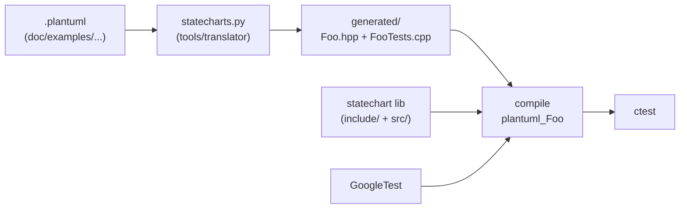

# PlantUML to C++ translator

This project ships a Python translator that reads
[PlantUML state diagrams](https://plantuml.com/fr/state-diagram) and
emits C++20 code targeting the in-tree
[`statechart`](architecture.md) library. The translator lives in
[`tools/translator/`](../tools/translator) and is invoked
automatically by CMake (option
`STATECHART_BUILD_PLANTUML_TESTS`, on by default) for every PlantUML
example under [`doc/examples/`](examples/).

## Limitations

The current translator is intentionally restricted to **flat finite
state machines**. The library itself supports far more, but the
generator does not yet emit:

- Hierarchical states (`state Foo { ... }`) — raises a clear error.
- Orthogonal regions (`--`/`||`) — raises a clear error.
- History pseudo-states (`H`, `H*`).
- Fork / join pseudo-states.
- Time-triggered transitions (`after(N)`).
- Multi-edges (several transitions sharing source *and* destination).

For each unsupported construct, the translator either fails fast with
a readable message or emits a `// WARNING` comment in the generated
header.

The translator is not a formal verifier: it does not check that
guards are mutually exclusive or that branches are reachable. The
[`tests/`](../tests) suite of the library covers the framework
behaviour, while the generated `plantuml_<Name>` tests cover compile
and entry of each example.

## Prerequisites

- Python 3 with `lark` and `networkx`. Install with:

  ```sh
  pip install -r tools/translator/requirements.txt
  ```

- A C++20 compiler and CMake 3.20+ (same requirements as the library).
- Optional: [PlantUML](https://plantuml.com) to render the `.png`
  artefacts from `.plantuml` sources.

## Command line

```sh
./tools/translator/statecharts.py <input.plantuml> hpp [postfix] [--outdir DIR]
```

Where:

- `input.plantuml` is the source diagram path.
- `hpp` selects header-only output (no `.cpp` is generated; everything
  goes inline in the `.hpp`).
- `postfix` is an optional suffix appended to the C++ class name and
  output file name (`Foo.plantuml` + postfix `Controller` ⇒
  `FooController.hpp`).
- `--outdir` defaults to the current working directory.

The script writes `<ClassName>.hpp` (the FSM class) and
`<ClassName>Tests.cpp` (a small GoogleTest suite). When the file stem
starts with a digit (e.g. `01_simple_state.plantuml`) the script
prefixes the C++ identifier with `Sm` so that the resulting class name
is valid.

## PlantUML syntax accepted

The grammar lives at
[`tools/translator/statecharts.ebnf`](../tools/translator/statecharts.ebnf).
The supported subset is:

- `FromState --> ToState : event [ guard ] / action`
- `FromState -> ToState : event [ guard ] / action`
- `ToState <-- FromState : event [ guard ] / action`
- `ToState <- FromState : event [ guard ] / action`
- `State : entry / action` (alias `entering`).
- `State : exit / action` (alias `leaving`).
- `State : do / action` (alias `activity`).
- `State : on event [ guard ] / action` (internal transition).
- `State : comment / description` to attach a `///` comment to the
  generated state.
- `'` for single-line comments.
- `[*]` as the (mandatory) source pseudo-state.
- `[*]` as an optional sink final-state.
- `\n--\n action` is an alias for `/ action` (lets PlantUML render
  carriage returns nicely).

The keywords `[ guard ]` and `/ action` are both optional. Spaces
around the tokens `-->`, `:`, `[]`, `/` are tolerated. Events must be
valid C++ identifiers (or `name(arg1, arg2)` to declare event
parameters).

## Injecting C++ code

Special `'` comments are interpreted by the translator as code-injection
points. They never produce a PlantUML syntax error, so the same source
file can be processed by both PlantUML (for rendering) and the
translator.

| Directive | Effect |
| --- | --- |
| `'[brief]` | Inserted as a `\brief` Doxygen comment on the generated class. |
| `'[header]` | Pasted **before** the class definition (typedefs, includes, helper structs). |
| `'[footer]` | Pasted **after** the class definition. |
| `'[param]` | Comma-joined into the constructor parameter list. |
| `'[cons]` | Initialiser-list entries (one per directive) for the constructor. |
| `'[init]` | C++ statements run at the **end** of the constructor body. |
| `'[code]` | Member declarations and methods. The block may contain `private:`/`protected:`/`public:` markers to switch visibility. |
| `'[test]` | Kept as a comment in the generated test file for reference. |

## Pipeline



Internally, the translator:

1. Loads the EBNF grammar and parses the PlantUML file via Lark.
2. Walks the AST and builds a `networkx.DiGraph` (nodes = states,
   edges = transitions, with parsed events / guards / actions).
3. Sanity-checks the graph (currently: warns when no `[*] -> X`
   initial transition is found).
4. Emits the FSM class:
   - One `class Ev<Name> : public statechart::Event` per named event.
   - The wrapper class composes a `std::unique_ptr<Statechart>`,
     creates pseudo/normal/final states via
     `chart->create<T>(...)`, and wires transitions via
     `chart->createTransition(...)` with `statechart::Guard{...}` and
     `statechart::Action{...}` lambdas.
   - Public counters `m_count_entering_<S>`,
     `m_count_leaving_<S>`, `m_count_guard_<src>_<dst>`,
     `m_count_action_<src>_<dst>` are incremented by the generated
     lambdas, letting unit tests assert how many times each
     callback fired without GMock.
   - One public `void <event>(<params>)` method per named event,
     which stashes the parameters in member variables and calls
     `m_chart->dispatch(...)`.
5. Emits a tiny GoogleTest file with two tests:
   - `EntersWithoutThrowing`: constructs the FSM, calls `enter()`,
     verifies `state()` returns a non-empty name, calls `leave()`.
   - `SmokeFireAllEvents`: fires every event method once with
     default-constructed arguments to exercise transition wiring.
