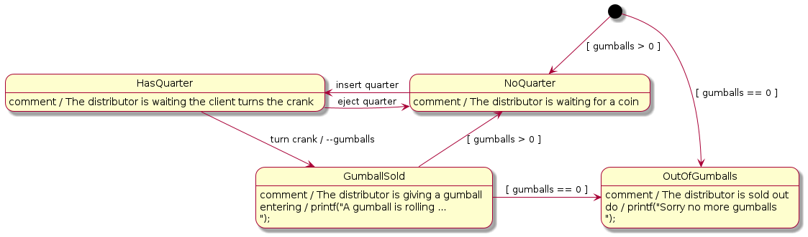
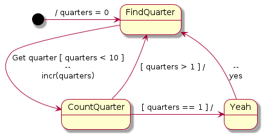
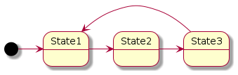

# Examples of statecharts the tool can parse

## Non hierarchic State Machines (FSM)

### Simple FSM


This example does not model a real system but shows all possible syntax the
tool can parse. Consider it as a cheat-sheet.

### Motor Controller


This example does not describe a real motor control but introduces a simple
example with event using data (`setSpeed(x)`), state actions (`Idle entry` and
`Idle exit`, guards `[x > 0]` ans internal events (transition from `Stop` to
`Idle` and transition from `Spinning` to `Spinning`).

The motor is initial not spinning. A positive reference speed makes it starts
spinning. A halt event makes it stop spinning.

FIXME: Double transitions are not yet managed:
```
Stop <- Spinning : setSpeed(x) [ x == 0 ]
Stop <- Spinning : halt
```

### Gumball Distributor



This example of the state machine of a gumballs distributor has been adapted
from the book *Head First Design Patterns* by Elisabeth Freeman, Edition
O'Reilly implementing the State Pattern. The book uses the design pattern
[state](https://sourcemaking.com/design_patterns/state) but in our case, since
this tool does not generate code with virtual methods, it is interesting to
compare the differences of code.

This example introduces guards used by the initial state `[*]` that will be
traduced by code generated inside the constructor of the state machine class.

The gumballs distributor has initially a given of number of gumballs. The client
to get a gumball has to add a coin in the distributor and turn the crank. The
number of gumballs is decreased. When no gumballs are available the client coin
is returned.

### Becoming a rich man



A punk guy with no money in pockets, find coins in the street but his pockets is
limited to 10 quarters.  This example introduces multiple output transitions
with guards.

### Lane Keeping System


Simulate a vehicle's Lane Keeping System (LKS). This is of course a toy code not
for production code.  The LKS is initially off, the driver press a button to
enable it (event `btn_LKS` pressed).  When the system detects a lane (event
`detect`) it follows the (event `set`).  The system returns to its initial state
(events `cancel`, `not detected`) and the driver can stop the LKS at any moment
(event `btn_LKS` pressed).

As action the system switch on/off LEDs and switch on/off the servoing motor
(for the steering direction).

### Self Parking Assistant


Simulate a vehicle's auto parking system. This is of course a toy code not for
production code.  The vehicle is initially stopped on the road or on the parking
slot. When the driver turn the turning indicator and if the assitant system is
controlling the vehicle and make it drive up to a distance of 25 meters at 1 m/s
speed (if no obstacle is detected along the path). When driving, the system is
scanning for the first empty spot (second state machine) and once an empty spot
has been detected the vehicle is computing its trajectory for entering (or
leaving) the parking spot. It does the maneuver if a trajectory is found.

The vehicle halts when detects an obstacle or has driven too far (no empty
parking spot) or when the maneuver is not possible or finished.

### Ethernet Box


Simulate the manager of an Ethernet box pairing a phone by wifi.

### Malformed state machines

The following examples: InfiniteLoop, BadSwitch are examples to test if the tool
detects some basic errors.




In these examples, since there is no explicit events, the system will never stop
commuting from `State1` to `State2` to `State1` in an atomic way (meaning within
a single system step). This case shall of course not happening else all your
system will be frozen and the tool is detecting them.

## Hierarchic State Machines (HSM)

**WARNING: All these examples are not yet parsed by the tool. In gestation**

## Simple Composite


## Simple Orthogonal


## Dead Man Detector for pump


